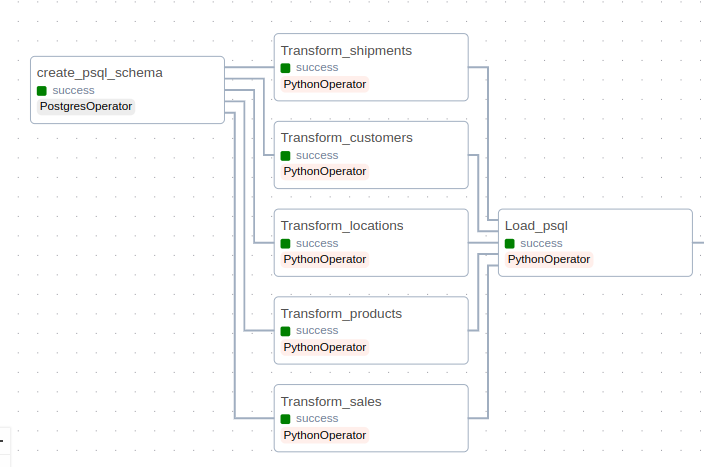
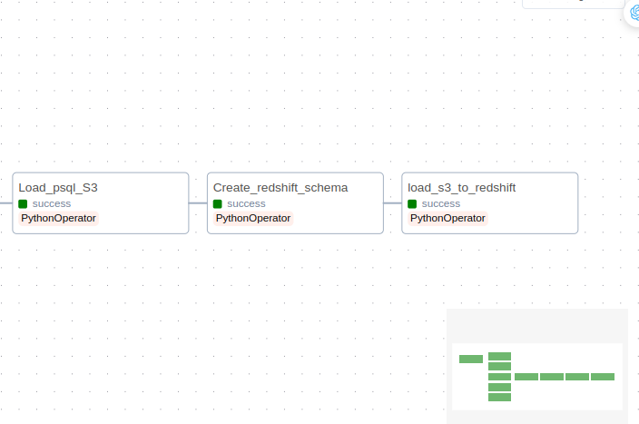

## 5. Implementation detail
### 5.1 Load sales data into PostgreSQL database



**Airflow tasks**

[Airflow dags](/dags/dags_setup.py)

  ```python
# ./dags_setup.py # Airflow dags
# -------------- Create schema task ------------- #
create_psql_schema = PostgresOperator(
    task_id = 'create_psql_schema',
    dag = dag,
    postgres_conn_id='postgres_airflow_db',
    sql= 'create_postgres_schema.sql'
)
# ---------------------------------------------- #


# ---------------- Extract task ---------------- #
Extract_from_source = PythonOperator(
    task_id = 'Extract_from_source',
    python_callable = Extract_from_source
)
# ---------------------------------------------- #


# ---------------- Transform task ---------------- #
transform_products_psql = PythonOperator(
    task_id = 'Transform_products',
    dag = dag,
    python_callable=Transform_products,
    op_kwargs={"Name" : "products", "filePath": "Products.csv"}
)

.....

transform_shipments_psql = PythonOperator(
    task_id = 'Transform_shipments',
    dag = dag,
    python_callable=Transform_shipments,
    op_kwargs={"Name" : "shipments", "filePath": "Shipments.csv"}
)
# ----------------------------------------------- #

# ----------------- Load task ----------------- #
load_psql = PythonOperator(
    task_id = 'Load_psql',
    dag = dag,
    python_callable=Load_schema
)
# -------------------------------------------- #
 ``` 


**1. Create_psql_schema :** Create PostgreSQL schema and its tables according to our data model design.
``` ./Create_Postgres_schema/create_pgsql_schema.sql ```

[Create Sale_schema](/Create_Postgres_schema/create_postgres_schema.sql)


**2. Extract_from_source :** Extract raw data from s3 bucket and store them in ***Input_data*** folder.

[Extract.py](/dags/ETL_S3_Postgres/Extract/extract.py)

You can't see this step in the Airflow dags graph because, for some reason, I can't download this data source anymore. You can use data from [data folder](/data/)
```python
config = configparser.ConfigParser()
config.read_file(open('/home/truong/airflow/dags/project_batch/config.cfg')) # sua path
KEY=config.get('AWS','key')
SECRET= config.get('AWS','secret')

def Extract_from_s3():
    session = boto3.Session(
        aws_access_key_id= KEY,
        aws_secret_access_key= SECRET
    )

    s3 = session.client("s3")
    bucket_name = 'amazon-us-sale-bucket'

    # List all object in bucket
    response = s3.list_objects_v2(Bucket = bucket_name)

    write_dir = "project_batch/data"
    for obj in response['Contents'] :
        key = obj['Key']

        write_path = os.path.join(write_dir, key)
        with open(write_path, "wb") as file:
            s3.download_fileobj(bucket_name, key, file)

```

<br> <br>
**3. Perform transformation :** This part split into 5 small tasks, each handle the data transformation on a specific topic.
There are 6 python files : ***Transform.py***, ***Transform_<b>name</b>.py*** where <b>name</b> correspond to a topic *****['sales', 'products', 'customers', 'shipments', 'locations'].*****
Each ***Transform_<b>name</b>py*** responsible for cleaning, transforming and integrating to a corresponding OLTP table. Python class is used,
all they all inherit from the parent class in ***Transform.py*** :

[Transform.py](/dags/ETL_S3_Postgres/Transform/Transform.py)

```dags/ETL_psql/Transform/Transform.py ```

```python
# ---------------------------------- Parent class ---------------------------------- #

class Transform_df : # Parent class for transformation of dataframe
    def __init__(self, Name, filePath = "") :
        self.root_dir = "/home/truong/airflow/dags/project_batch/data"
        self.write_dir = "/home/truong/airflow/dags/project_batch/Transformed_data"

        
        try : 
            path = os.path.join(self.root_dir, filePath)
            self.df = pd.read_csv(path)
        except :
            self.df = pd.DataFrame()
        
        self.name = Name
       
        self.clean()             # Drop duplicate values in primary key columns
        self.extract_var()        # Add additional variables if necessary
        self.transform()         # Perform transformation on data
        self.rename_column()     # Rename column to fit PostgreSQL table column names
        self.write_csv()         # Write to 'self.write_dir' folder

    def extract_var(self) : # Additional variables and setting
        pass

    def get_primary_column(self) :  # Primary key columns mostly contain "ID" in their name
        for col in self.df.columns :
            if ("ID" in col) : return col

    def clean(self) : # Drop duplicate values in primary key columns (still keep one)
        self.df.drop_duplicates(subset = [self.get_primary_column()], keep = 'first', inplace = True)

    def transform(self) : # Transform data
        pass

    def rename_column(self) :
        # This function renames all columns to fit postgreSQL database format
        # details can be found in file `Rename_col_df.py`
        self.df.rename(columns = column_dict[self.name], inplace = True)

    def write_csv(self) :
        write_path = os.path.join(self.write_dir, self.name + ".csv")
        self.df.to_csv(write_path, index = False)

```

*****a. Transform_locations.py*** -> ***Transform_locations class*****

[Transform_locations.py](/dags/ETL_S3_Postgres/Transform/Transform_location.py)

```python
class Transform_location_df(Transform_df) : # Transform locations dataframe class
    ...
    def transform(self):
        self.customer_df['Address_Postal_code'] = self.customer_df['Address'].astype('str') + '-' + self.customer_df['Postal code'].astype('str')
        self.customer_df.drop(columns=['Address', 'Postal code'], inplace=True)

        address_arr = [address.split(',') for address in self.shipment_df]

        location_dict = {}
        location_dict['Address'] = [address[0] for address in address_arr]
        location_dict['Postal code'] = [address[4] for address in address_arr]
        location_dict['City']        = [address[1] for address in address_arr]
        location_dict['State']       = [address[2] for address in address_arr]
        location_dict['Country']     = [address[3] for address in address_arr]       

        location_df = pd.DataFrame(location_dict)
        location_df['Address_Postal_code'] = location_df['Address'].astype('str') + '-' + location_df['Postal code'].astype('str')
        location_df.drop(columns=['Address', 'Postal code'], inplace=True)

        # concat customer_df and location_df
        self.df = pd.concat([self.customer_df, location_df])
        self.df = self.df[['Address_Postal_code', 'City', 'State', 'Country']]
        self.df.drop_duplicates(subset=['Address_Postal_code'], inplace=True)

```


- Initially there is no csv file for locations, this class is generated from 'Customers.csv' and 'Shipments.csv' to store data
about locations by extracting customer and shipping addresses, merge them into a new dataframe. By doing this, we could reduce
dimensions in both 'customer' and 'shipment' dataframe, have better relationship as well.


***b. Transform_customers.py*** -> ***Transform_customers class***

[Transform_customers.py](/dags/ETL_S3_Postgres/Transform/Transform_customers.py)

```python
class Transform_customer_df(Transform_df) : # Transfrom customers dataframe class    
    def transform(self):
        self.df.drop(columns= ['City', 'State', 'Country'], inplace= True)
        self.df['Address_Postal_code'] = self.df['Address'] + '-' + self.df['Postal code'].astype(str)

def Transform_customers(Name, filePath) :
    customer = Transform_customer_df(Name, filePath)
```
- Drop columns ['City', 'State', 'Country']


***c. Transform_shipments.py*** -> ***Transform_shipments class***

[Transform_shipments.py](/dags/ETL_S3_Postgres/Transform/Transform_shipments.py)

```python
    def transform(self):
        self.df.drop_duplicates(subset=['Order ID'], keep='first', inplace= True)

        self.df['Shipping status'] = self.df['Shipping status'].str.lower()

        self.df['Shipping address'] = [address.split(',')[0] for address in self.df['Destination']]
        self.df['Shipping zipcode'] = [address.split(',')[4] for address in self.df['Destination']]

        self.df['Shipping address zipcode'] = self.df['Shipping address'].astype(str) + '-' + self.df['Shipping zipcode'].astype(str)

        self.df.drop(columns=['Destination'], inplace=True)

def Transform_shipments(Name, filePath):
    shipment = Transform_shipment_df(Name, filePath)       
```

- Create new columns 'Shipping address' and 'Shipping zipcode' from original column 'Destination'.
- Create new column 'Shipping address zipcode'
- Convert column 'Shipping status' to lowercase letters 
- Drop duplicate values in column 'Order ID', since each 'Order ID' can belong exactly to one 'Shipment ID' only.
- Drop columns 'Destination'


***d. Transform_products.py*** -> ***Transform_products class***

[Transform_products.py](/dags/ETL_S3_Postgres/Transform/Transform_products.py)

```python
class Transform_product_df(Transform_df) : # Transform products dataframe class
    def transform(self):
        # PRODUCT_SIZE column is an unecessary column
        self.df['PRODUCT_SIZE'] = [0 for i in range(len(self.df))]
        # fillna missing values
        self.df['BRAND'].fillna('Unknown', inplace=True)

        # create new column from sell price and commision rate column
        self.df['COMMISION'] = self.df['SELL PRICE'] * self.df['COMMISION RATE'] / 100

def Transform_products(Name, filePath):
    product = Transform_product_df(Name, filePath)
```

- Fill null value in column "BRAND" with "unknown".
- Create new column 'COMMISION' which is the profit gained by selling the product.


***e. Transform_sales.py*** -> ***Transform_sales class***

[Transform_sales.py](/dags/ETL_S3_Postgres/Transform/Transform_sales.py)

```python
class Transform_sale_df(Transform_df) : # Transform sales dataframe class
    def extract_var(self):
        filePath = os.path.join(self.root_dir, "Products.csv")
        product_df = pd.read_csv(filePath)

        product_df = [(product_df['PRODUCT_ID'][i], 
                      product_df['COMMISION RATE'][i]) for i in range(len(product_df))]

        self.product_df = sorted(product_df, key= lambda x : x[0])
        self.n = len(self.df)

        self.product = list(self.df['Product ID'])
        self.total_cost = list(self.df['Total cost'])

    def search_product(self, sale_product_id): # binary search
        l = 0
        r = len(self.product_df) - 1

        while(l <= r) :
            mid = int((l + r) / 2)
            product_id, product_comm_rate = self.product_df[mid]

            if (product_id > sale_product_id) : 
                r = mid - 1
            elif (product_id < sale_product_id): 
                l = mid + 1
            else:
                return product_id, product_comm_rate
            
    def transform(self):
        self.df['Date'] = [datetime.strptime(date, "%m-%d-%y").date() 
                            for date in self.df['Date']]
        
        # Create `revenue_arr` list which stores 'product_comm_rate' of each 'sale_product_id'
        revenue_arr = [self.search_product(self.product[i]) for i in range(self.n)]

        self.df['Profit'] = [(self.total_cost[i] * val[1] /100) for i, val in enumerate(revenue_arr)]

def Transform_sales(Name, filePath):
    sale = Transform_sale_df(Name, filePath)
```

- Covert to datetime format for column 'Date'
- Calculate column 'Profit' which is the total cost of each 'Order ID' (there is quite a lot of inconsistent between 
table 'Products' and 'Sales') by using binary search function ```search_product(self, sale_prod_id) ``` :

    - Store column 'PRODUCT ID' from dataframe 'Products' in a list and sort it
    - For each 'Product ID' in an 'Order ID' in 'Sales' dataframe, perform binary search to retrieve 'Product sell price' & 'Product commision rate'


***f. Rename_column.py*** : This file renames columns in all dataframes to fit PostgreSQL schema.**
 

**4. Load_to_psql :** Load all transformed data into PostgreSQL database.

[Load_psql.py](/dags/ETL_S3_Postgres/Load/Load.py)

```.airflow/dags/ETL_psql/Load/Load_psql.py```

```python
def Load_table(table_name, df, cur):
    df = df.convert_dtypes()
    records = df.to_records(index= False)

    column_names = ', '.join(df.columns)

    s_list = ', '.join(['%s'] * len(df.columns))

    query = f"""
        INSERT INTO {table_name} ({column_names}) VALUES ({s_list})
    """

    cur.executemany(query, records)

    print(f"Successfully insert data to table {table_name}")

def Load_schema():
    connect_params = {
        "host" : HOST,
        "dbname" : DB_NAME,
        "user" : DB_USER,
        "password" : DB_PASSWORD
    }
    conn = psycopg2.connect(**connect_params)
    cur = conn.cursor()
    conn.set_session(autocommit= True)

    table_orders = ['locations', 'customers', 'products', 'sales', 'shipments']
    root_dir = "/home/truong/airflow/dags/project_batch/Transformed_data" #sua path
    for table in table_orders:
        filePath = os.path.join(root_dir, table + ".csv")
        while(os.path.isfile(filePath) != True): time.sleep(3)

        df = pd.read_csv(filePath)
        Load_table(f"Sale_schema.{table}", df, cur)

    cur.close()
    conn.close()
```

Since there is foreign key constraints, the table must be loaded in order ['locations'->'customers'->'products'->'sales'->'shipments'].
Psycopg2 library is used to establish connection to PostgreSQL database "airflow", each table is loaded using function ```Load_table(table_name, df, cur)```
that loads dynamically any dataframe 'df' to table 'table_name'.
 
### 5.2 Load data from PostgreSQL to Amazon Redshift :


[dags_setup.py](/dags/dags_setup.py)

**Airflow tasks**
  
```python
  
load_to_s3 = PythonOperator(
    task_id='Load_psql_S3',
    dag=dag,
    python_callable=ETL_s3
)

Create_redshift_schema = PythonOperator(
    task_id='Create_redshift_schema',
    dag=dag,
    python_callable=create_redshift_schema,
    op_kwargs= {'root_dir' : '/home/truong/airflow/dags/project_batch/Create_Redshift_schema'}
)

load_s3_redshift = PythonOperator(
    task_id='load_s3_to_redshift',
    dag=dag,
    python_callable=Load_s3_to_redshift
)
```

**1. ETL_psql_s3 :** Extract data from PostgreSQL database, perform transformation, and load to S3 bucket

[ETL_psql_s3.py](/dags/ETL_redshift/ETL_psql_s3.py)

*****Extract data from PostgreSQL database*****
  
```python
# ----------------------------------- Extract ----------------------------------- 

def Extract_from_postgres(df_dict):
    conn = Connect_postgres()
    cur = conn.cursor()

    table_list = ['customers', 'locations', 'products', 'sales', 'shipments']

    for table in table_list:
        query = """
            SELECT column_name 
            FROM information_schema.columns
            WHERE table_schema = 'sale_schema'
            AND table_name = '{}'
        """.format(table)

        cur.execute(query)

        column_list = list(cur.fetchall())
        column_list = [column[0] for column in column_list]

        #query data
        data_query = """
            SELECT * FROM sale_schema.{}
        """.format(table)
        cur.execute(data_query)

        df_dict[table] = pd.DataFrame(columns=column_list, data=cur.fetchall())
    
    cur.close()
    conn.close()
```

*****Transformation step is done to fit star schema design in warehouse.*****

```python
# ----------------------------------- Transform -----------------------------------

def Generate_date_df():
    start_date = datetime(2022,1,1)
    end_date = datetime(2022,12,31)

    time_arr = [start_date + timedelta(days= i) for i in range((end_date - start_date).days + 1)]
    time_dict = {}
    time_dict['full_date'] = []
    time_dict['day'] = []
    time_dict['month'] = []
    time_dict['year'] = []

    for date in time_arr:
        time_dict['full_date'].append(date.date())
        time_dict['day'].append(date.day)
        time_dict['month'].append(date.month)
        time_dict['year'].append(date.year)

    return time_dict

def joining_df(df1, df2, left, right):
    return df1.merge(df2, left_on = left, right_on= right, how= 'inner')

def dropping_column(df, list_column):
    df.drop(columns= list_column, inplace= True)

def Transform(df_dict):
    df_dict['time'] = pd.DataFrame(Generate_date_df())

    # join shipments_df to sales_df on 'order_id'
    df_to_join = df_dict['shipments'][['order_id', 'shipment_id', 'shipping_cost', 'shipping_address_zipcode']]
    df_dict['sales'] = joining_df(df_dict['sales'], df_to_join, 'order_id', 'order_id')

    # join shipments_df to location_df on Shipping_adress_zipcode
    df_to_join = df_dict['shipments'][['shipping_address', 'shipping_address_zipcode']]
    df_dict['locations'] = joining_df(df_dict['locations'], df_to_join, 'address_postal_code', 'shipping_address_zipcode')

    # Drop unnecessary column
    dropping_column(df_dict['customers'], ['address', 'postal_code', 'address_postal_code'])
    dropping_column(df_dict['shipments'],['shipping_cost','order_id','shipping_address','shipping_address_zipcode'])
    dropping_column(df_dict['locations'],['shipping_address_zipcode'])

        # Rename column
    df_dict['sales'].rename(columns = {"order_id" : "sale_id", "total_cost" : "revenue"}, inplace = True)
    
    # Re-order columns to fit redshift table
    df_dict['sales'] = df_dict['sales'][['sale_id', 'revenue', 'profit', 'quantity', 'shipping_cost',\
                                'product_id', 'customer_id', 'shipping_address_zipcode', 'order_date', 'shipment_id']]
    
```

*****Load data to S3 bucket*****
```python
# ----------------------------------- Load -----------------------------------

def upload_to_s3(s3, bucket_name, df, key):
    csv_buffer = BytesIO()
    df.to_csv(csv_buffer, index= False)
    csv_buffer.seek(0)

    s3.upload_fileobj(csv_buffer, bucket_name, key + '.csv')

def Load_S3(df_dict):
    session = boto3.Session(
        aws_access_key_id= KEY,
        aws_secret_access_key= SECRET
    )

    s3 = session.client("s3")
    bucket_name='ductruong-sale-bucket'

    try :
        response = s3.list_objects_v2(Bucket = bucket_name)
        for obj in response['Contents']:
            key = obj['Key']
            s3.delete_object(Bucket = bucket_name, Key = key)
    except :
        pass

    for table, df in df_dict.items():
        print(f"Loading {table} to S3")
        upload_to_s3(s3,bucket_name,df,table)
        print("Load successfully \n")

def ETL_s3():
    pd.set_option('display.max_columns', None)
    df_dict = {}
    Extract_from_postgres(df_dict)
    Transform(df_dict)
    Load_S3(df_dict)
```

**2. Create_redshift_schema :** Create redshift schema

```./Create_redshift_schema/create_redshift_schema.sql```

[create_redshift_schema.sql](/Create_Redshift_schema/create_redshift_schema.sql)
 
```.dags/ETL_redshift/ETL_S3_redshift.py -> connect_redshift() & create_redshift_schema() ```

[Load_s3_to_redshift.py](/dags/ETL_redshift/ETL_S3_redshift.py)

```python
def connect_redshift():
    conn = psycopg2.connect("host={} dbname={} user={} password={} port={}".format(*config['CLUSTER'].values()))

    conn.set_session(autocommit=True)

    return conn

def create_redshift_schema(root_dir):
    conn = connect_redshift()
    cur = conn.cursor()

    path = os.path.join(root_dir, "create_redshift_schema.sql")
    with open(path, 'r') as file :
        redshift_sql = file.read()
    
    redshift_sql = redshift_sql.split(";")
    redshift_sql = [statement + ";" for statement in redshift_sql]

    for idx, statement in enumerate(redshift_sql) :
        if (statement == ";") : continue
        cur.execute(statement)

    print("Create redshift schema successfully")
    cur.close()
    conn.close()
```
  
Establish redshift connection using **psycopg2** library, redshift schema will be created using redshift_connector

**3. Load_s3_redshift :** Load data from S3 bucket to Redshift

[Load_s3_to_redshift.py](/dags/ETL_redshift/ETL_S3_redshift.py)

```.dags/ETL_redshift/ETL_S3_redshift.pyy -> Load_s3_to_redshift() ```

```python
def Load_s3_to_redshift() : # Load data from s3 to redshift
    conn = connect_redshift()
    cur = conn.cursor()
    table_list = ['customers', 'products', 'locations', 'time', 'shipments', 'sales']
    bucket_name = "ductruong-sale-bucket"
    schema = "warehouse_sales"

    for table in table_list :      
        query = f"""
            COPY {schema}.{table}
            FROM 's3://{bucket_name}/{table}.csv'
            IAM_ROLE '{ARN}'
            FORMAT AS CSV
            IGNOREHEADER 1
            FILLRECORD;
        """

        cur.execute(query)
    

    cur.close()
    conn.close()
```

Load each table from S3 bucket to redshift using COPY command.
  
