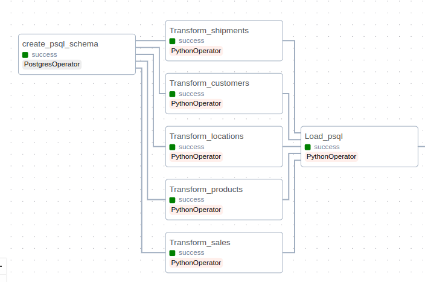
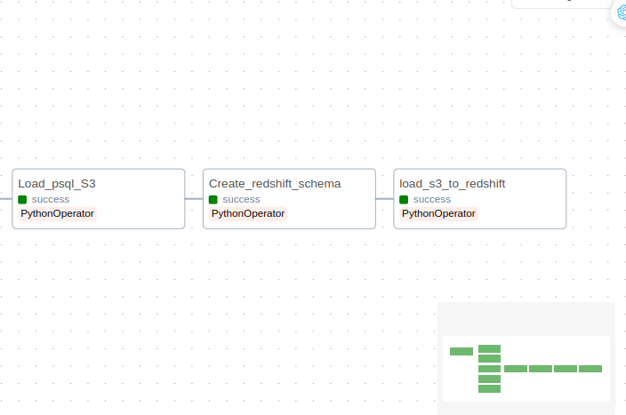

# Batch Processing : ETL pipeline, data modelling and warehousing of Sales data

## Table of Contents
- [Batch Processing : ETL pipeline, data modelling and warehousing of Sales data](#batch-processing--etl-pipeline-data-modelling-and-warehousing-of-sales-data)
  - [Table of Contents](#table-of-contents)
  - [1. Introduction](#1-introduction)
    - [Technologies used](#technologies-used)
  - [2. Implementation overview](#2-implementation-overview)
  - [3. Design](#3-design)
  - [4. Project Structure](#4-project-structure)
  - [5. Settings](#5-settings)
    - [Prerequisites](#prerequisites)
    - [Important note](#important-note)
  - [6. Implementation](#6-implementation)
    - [Refer to Implementation detail.md for more details on implementation](#refer-to-implementation-detailmd-for-more-details-on-implementation)
    - [6.1 Load sales data into PostgreSQL database](#61-load-sales-data-into-postgresql-database)
    - [6.2 Load data from PostgreSQL to Amazon Redshift](#62-load-data-from-postgresql-to-amazon-redshift)
  - [7. Visualize result](#7-visualize-result)
    - [Results](#results)


## 1. Introduction 
Data is collected from an e-commerce company about their sales in 2022, the company's analytic teams is interested in understanding their business situation in the last year. We will build ETL pipelines which will transform raw data into actionable insights, store them in OLTP database (PostgreSQL) and OLAP database (Amazon Redshift) for enhanced data analytics capabilities.

Data include 4 csv files :***Sales, Products, Shipments, Customers.***

### Technologies used
- Python
- PostgreSQL
- Airflow
- AWS services : S3, Redshift (data warehouse)

## 2. Implementation overview 
Design data models for OLTP database (PostgreSQL) and data warehouse (Amazon Redshift). Build an ETL pipeline to transform raw data into actionable insights in PostgreSQL, also store them in S3 for staging. Then implement another ETL pipeline which process data from S3 and load them to Amazon Redshift for enhanced data analytics . Using Airflow to orchestrate pipeline workflow, Terraform for setting up AWS Redshift cluster, and Docker to containerize the project - allow for fast build, test, and deploy project.


## 3. Design 
***Data model for Postgres***


***Data model for Redshift (Star Schema)***


## 4. Project Structure

```bash

Batch-Processing/
  ├── dags/
  │   ├── dags_setup.py
  │   ├── ETL_S3_Postgres
  │   │   ├── Extract
  │   │   │   └── extract.py
  │   │   ├── Load
  │   │   │   └── Load.py
  │   │   └── Transform
  │   │       ├── Rename_column.py
  │   │       ├── Transform.py
  │   │       ├── Transform_customers.py
  │   │       ├── Transform_locations.py
  │   │       ├── Transform_products.py
  │   │       ├── Transform_shipments.py
  │   │       └── Transfrom_sales.py
  │   └── ETL_redshift
  │       ├── ETL_psql_s3.py
  │       └── Load_s3_redshift.py
  ├── Create_Postgres_schema
  │   └── create_pgsql_schema.sql
  ├── Create_Redshift_schema
  │   └── create_redshift_schema.sql
  ├── picture
  │   └── Many images.png
  ├── S3_transformed_data
  ├── Data
  ├── Transformed_data
  ├── config.cfg
  ├── Implementation detail.md
  └── readme.md
```

## 5. Settings

### Prerequisites
- AWS account

### Important note

***You must specify AWS credentials for each of the following***

- AWS access : Create an IAM user "admin" with ***AdministratorAccess*** policy, create access credentials and add them to [config](config.cfg) to access S3 and Redshift cluster
- Redshift role : Create an IAM role "MyredshiftRole" with ***AmazonS3ReadOnlyAccess*** policy, create accesss credentials and add them when you create Redshift Cluster(In my case, i use Redshift serverless and add them to Associated IAM role in Redshift configuration).

## 6. Implementation

### Refer to [Implementation detail.md](/Implementation%20detail.md) for more details on implementation

***Airflow dags Graph***


### 6.1 Load sales data into PostgreSQL database



**Airflow tasks**


 ```python
# ./dags_setup.py # Airflow dags
# -------------- Create schema task ------------- #
create_psql_schema = PostgresOperator(
    task_id = 'create_psql_schema',
    dag = dag,
    postgres_conn_id='postgres_airflow_db',
    sql= 'create_postgres_schema.sql'
)
# ---------------------------------------------- #


# ---------------- Extract task ---------------- #
Extract_from_source = PythonOperator(
    task_id = 'Extract_from_source',
    python_callable = Extract_from_source
)
# ---------------------------------------------- #


# ---------------- Transform task ---------------- #
transform_products_psql = PythonOperator(
    task_id = 'Transform_products',
    dag = dag,
    python_callable=Transform_products,
    op_kwargs={"Name" : "products", "filePath": "Products.csv"}
)

.....

transform_shipments_psql = PythonOperator(
    task_id = 'Transform_shipments',
    dag = dag,
    python_callable=Transform_shipments,
    op_kwargs={"Name" : "shipments", "filePath": "Shipments.csv"}
)
# ----------------------------------------------- #

# ----------------- Load task ----------------- #
load_psql = PythonOperator(
    task_id = 'Load_psql',
    dag = dag,
    python_callable=Load_schema
)
# -------------------------------------------- #
 ``` 
 
***1. Create_psql_schema :*** Create PostgreSQL schema and its tables according to our data model design.

***2. Extract_from_source :*** Extract raw data from s3 bucket and store them in **Input_data** folder.

***3. Perform transformation :*** This part split into 5 small tasks, each handle the data transformation on a specific topic.
There are 6 python files : **Transform.py**, **Transform_name.py** where ***name*** correspond to a topic ***['sales', 'products', 'customers', 'shipments', 'locations'].***
Each **Transform_name.py** responsible for cleaning, transforming and integrating to a corresponding OLTP table. Python class is used,
all they all inherit from the parent class in **Transform.py** :

***4. Load_to_psql :*** Load all transformed data into PostgreSQL database.


### 6.2 Load data from PostgreSQL to Amazon Redshift

***Airflow tasks***
  
```python
# ./dags_setup.py # Airflow dags
ETL_s3 = PythonOperator(
    task_id = "ETL_s3",
    python_callable = ETL_s3
)

Create_redshift_schema = PythonOperator(
    task_id = "Create_redshift_schema",
    python_callable = Create_redshift_schema,
    op_kwargs = {"root_dir" : "/opt/airflow/redshift_setup"}  
)

Load_s3_redshift = PythonOperator(
    task_id = "Load_s3_redshift",
    python_callable = Load_s3_to_redshift
)
```
***1. ETL_s3 :*** Extract data from PostgreSQL database, perform transformation, and load to S3 bucket 

***2. Create_redshift_schema :*** Create redshift schema

***3. Load_s3_redshift :*** Load data from S3 bucket to Redshift

## 7. Visualize result

Connect redshift to metabase and visualize results


### Results

**Revenue by Month**

  
**Brand Popularity**

  
**Top 10 best selling Product**


**Shipping orders by Company**

  
